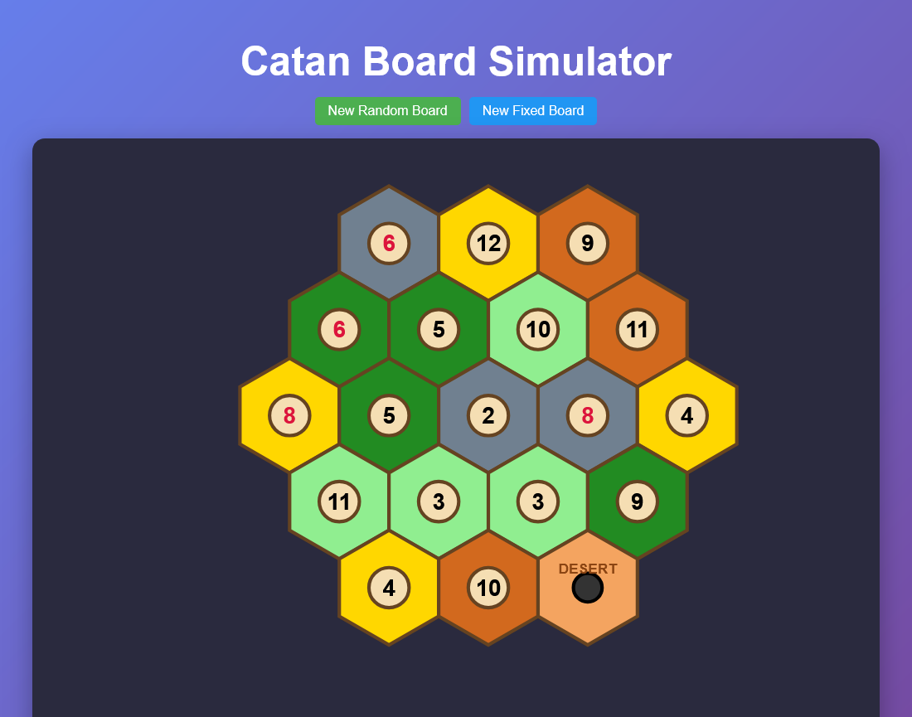
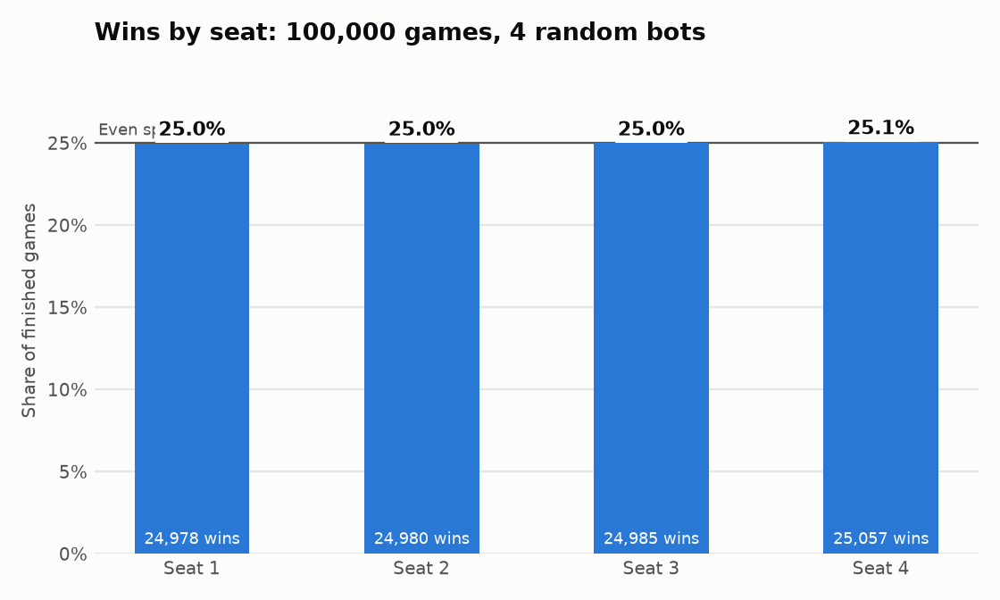
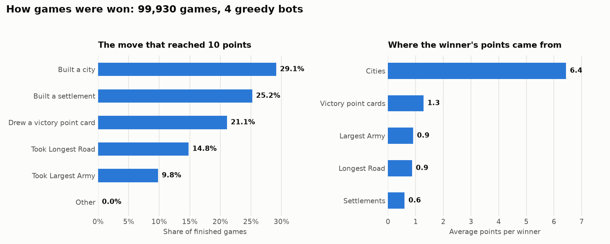
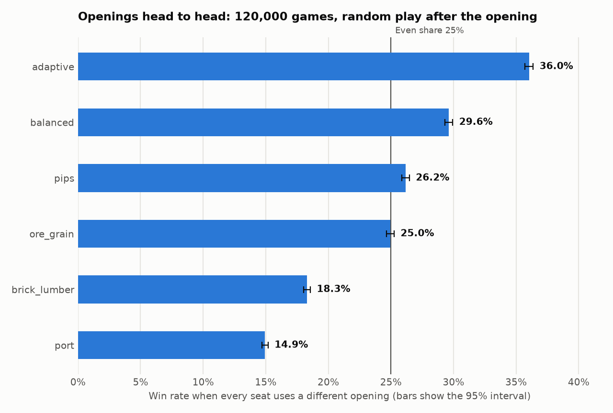

# Settlers

[](https://github.com/ParkerStephenJohnson/Settlers/actions/workflows/ci.yml)

A Catan board simulator: a Python API that generates boards and a React app that draws them.



## What it does today

- **Game engine:** plays complete games of Catan from setup to a 10-point win, with every decision made by chance, at about 115 games per second on one core
- **Board API:** generates a classic 19-hex board in the 3-4-5-4-3 layout and serves it as JSON from FastAPI
- **Web app:** renders the board as SVG in the browser, with red 6s and 8s and the robber starting on the desert

The engine and the web app are not connected yet: the browser shows boards, and games run from the command line.

## Game engine

The engine lives in `backend/src/engine` and is built to finish many games quickly.

```bash
cd backend
uv run python -m src.engine.simulate --games 100000 --workers 16
```

```
100000 games, 4 random bots, 16 worker(s)
  time           80.32 s
  speed          1,245 games/s
  finished       100000 (100.0%)
  avg turns      291
  player trades  143.9 per game
  wins by seat   1: 25.0%  2: 25.0%  3: 25.0%  4: 25.1%
```

That run was on a 16-core Windows desktop. One core does about 115 games per second.

By default every player is the random model: the rules engine plus chance, with no strategy. Each decision is a uniform random pick among what the rules allow, including which trades to propose and whether to accept them. Under pure chance no seat has an advantage.

Add `--plot ../docs` to save two charts:





**Rules covered:** the setup draft, production with bank shortages, the robber and discards on a 7, roads, settlements, cities, all five development cards, ports and bank trades, trades between players, longest road, largest army, and winning at 10 points.

Rules follow the official CATAN base game rulebook (2020 edition), including playing one development card at any time in your turn, before or after the roll, and keeping 6s and 8s apart. Pass `--no-dev-before-roll` for the house rule that cards wait until after the roll.

**Trading between players:** on your turn you can offer any bundle of cards for any other bundle, as many times as you like. Players holding everything you asked for answer in seat order, and if several accept you pick one. An offer that was just turned down cannot be repeated until a trade goes through or the turn ends. Gifts and swaps of the same resource are not allowed.

**Not covered yet:** the official harbour positions (harbours are spaced evenly with shuffled types).

**Players:**

- `random` (default) is pure chance. On its turn, proposing a trade is one more option alongside its other legal moves; a proposal is a random bundle of its own cards for a random bundle of one opponent's cards, of any size. It accepts or refuses offers on a coin flip.
- `greedy` is a simple strategy, kept for comparison: it builds the most valuable thing it can afford and trades toward its next purchase. Games are about a third as long. Later seats win more often with it, and about one game in a thousand stalls at the turn limit.

Options: `--bot greedy`, `--max-offers N` to cap trade offers per turn, `--no-player-trading` for bank and port trades only.

**Phases:** a `PhasedBot` is built from one policy per phase of the game. Today there are two phases: the opening (the two starting settlements and roads) and everything after it, which is random by default.

```python
from src.engine import PhasedBot
from src.engine.simulate import run_game

bots = [PhasedBot("balanced"), PhasedBot("random"), PhasedBot("random"), PhasedBot("random")]
game = run_game(bots, seed=1)
```

Openings compete head to head: every seat in a game uses a different opening, with line-ups and seats shuffled, and everyone plays at random afterwards.

```bash
uv run python -m src.engine.openings --games 100000 --workers 16 --diff --plot ../docs
```



| Opening | What it picks | Head to head | Alone against random openings |
|---|---|---|---|
| `adaptive` | Reads the board; settings found by search | 36.0% | 74.9% |
| `balanced` | Most dice pips, plus a bonus for each different resource | 29.6% | 68.0% |
| `pips` | Most dice pips | 26.2% | 65.2% |
| `ore_grain` | Pips weighted toward ore and grain | 25.0% | 60.4% |
| `brick_lumber` | Pips weighted toward brick and lumber | 18.3% | 54.6% |
| `port` | Pips plus a bonus for a harbour | 14.9% | 56.7% |

An even share is 25%. Head-to-head figures come from 120,000 games (about 80,000 per opening) and are accurate to about 0.3 points. `--vs-random` runs the second column on its own.

**The adaptive opening** values each spot by reading the board in front of it:

- how many pips of each resource the whole board has, so a resource in drought is worth more and one in surplus less
- what the player's first settlement already produces, so the second fills the gaps
- 2:1 harbours, by how much of that resource the player would produce
- how many different resources and dice numbers a spot touches

Its eleven settings were found by an evolution search: each candidate plays one seat against three of the strongest openings, the best survive and are mutated, and the finalists are re-tested on fresh games.

```bash
uv run python -m src.engine.opening_search --generations 8 --population 24 --games 2500 --workers 16
```

The search put the most weight on covering resources the player does not have yet and on variety, valued ore and grain above brick and lumber and wool lowest, used scarcity moderately, and gave harbours little weight.

A second round with wider ranges and `adaptive` itself among the opponents found nothing clearly better: its best finalist scored 29.5% against the champion's 29.0% on the same 60,000 games, which is within the noise. These features have levelled off.

**How it stays fast:** board geometry is computed once at import. Game state is flat lists of integers indexed by player, hex, node and edge. Actions are single integers. Games are seeded, so any game can be replayed exactly.

Using it from Python:

```python
from src.engine import Game, RandomBot

game = Game(num_players=4, seed=1)
bot = RandomBot()
while not game.done:
    game.apply(bot.choose(game, game.legal_actions(bot.lists_offers)))
print(game.winner, game.turn)
```

## How it works

For the board API, the backend lays hexes out in offset rows, then converts them to axial coordinates (`q`, `r`) so the frontend can place each hex with one formula. The conversion follows the [Red Blob Games hexagonal grid guide](https://www.redblobgames.com/grids/hexagons/).

```
backend/
  main.py          FastAPI app and routes
  src/board.py     Board generation for the API
  src/engine/      Game engine, computer players and simulator
  tests/           Board, API and engine tests
frontend/
  src/App.tsx      Board rendering
```

## Running it

You need Python 3.9+ with [uv](https://docs.astral.sh/uv/), and Node.js.

Start the API on port 8000:

```bash
cd backend
uv sync
uv run python main.py
```

Start the web app on port 5173, in a second terminal:

```bash
cd frontend
npm install
npm run dev
```

Then open http://localhost:5173.

## API

| Route | Returns |
|---|---|
| `GET /api/board/new` | A shuffled board |
| `GET /api/board/new?randomize=false` | The same board every time |

Each hex looks like this:

```json
{ "q": 1, "r": 0, "terrain": "hills", "resource": "brick", "number": 6, "has_robber": false }
```

## Tests

```bash
cd backend
uv run pytest
```

## License

[MIT](LICENSE)

## Note

This is a personal project. It is not affiliated with or endorsed by Catan GmbH or Catan Studio.
