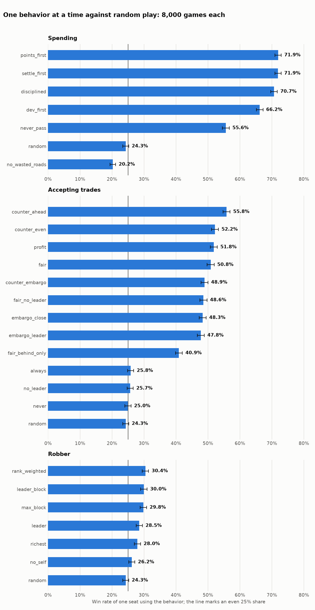
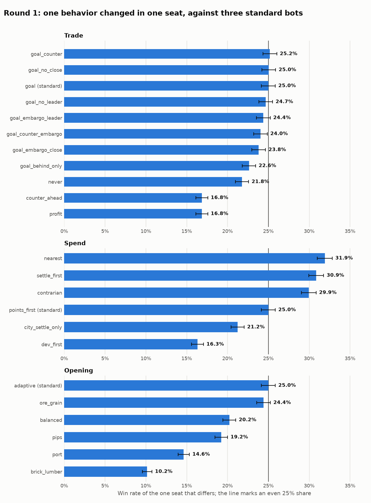
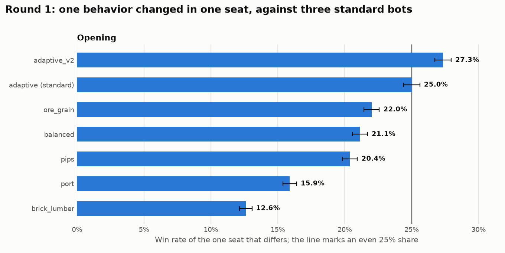
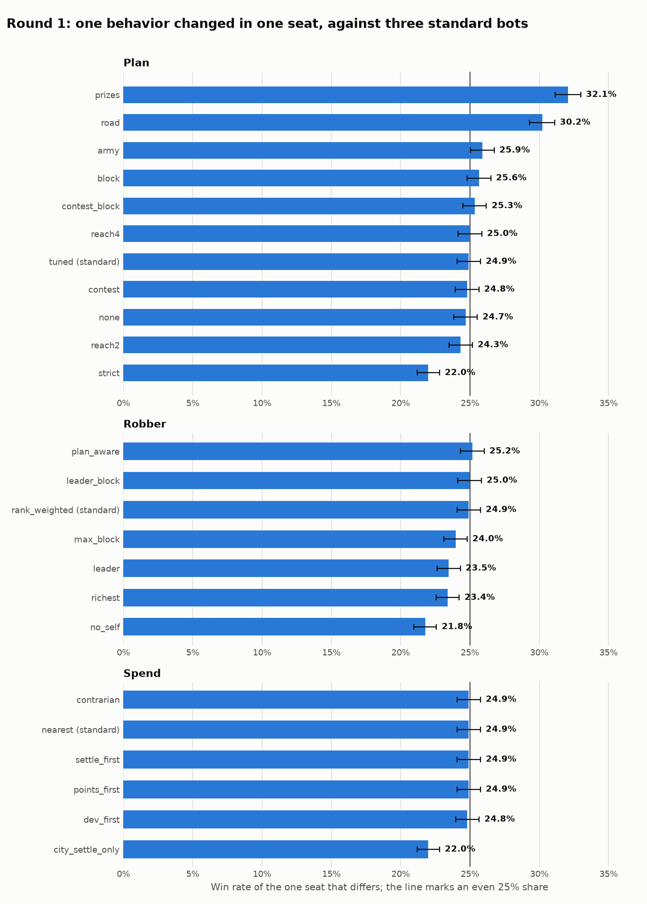

# Settlers

[](https://github.com/ParkerStephenJohnson/Settlers/actions/workflows/ci.yml)

A Catan rules engine and strategy lab. It plays complete games fast, so strategies can be compared over hundreds of thousands of games, one decision at a time.


## What it does today

- **Game engine:** plays complete games of Catan from setup to a 10-point win, following the official rules, at over 1,000 games per second on a 16-core desktop
- **Strategy lab:** every kind of decision (opening, spending, building, trading, the robber and more) is a swappable policy. Experiments change one policy in one seat and measure the effect on win rate
- **Board API:** generates a classic 19-hex board in the 3-4-5-4-3 layout and serves it as JSON from FastAPI
- **Web app:** renders the board as SVG in the browser, with red 6s and 8s and the robber starting on the desert

The engine and the web app are not connected yet: the browser shows boards, and games run from the command line.

## Game engine

The engine lives in `backend/src/engine` and is built to finish many games quickly.

```bash
cd backend
uv run python -m src.engine.simulate --games 100000 --workers 16
```

```
100000 games, 4 random bots, 16 worker(s)
  time           80.32 s
  speed          1,245 games/s
  finished       100000 (100.0%)
  avg turns      291
  player trades  143.9 per game
  wins by seat   1: 25.0%  2: 25.0%  3: 25.0%  4: 25.1%
```

That run was on a 16-core Windows desktop. One core does about 115 games per second.

By default every player is the random model: the rules engine plus chance, with no strategy. Each decision is a uniform random pick among what the rules allow, including which trades to propose and whether to accept them. Under pure chance no seat has an advantage.

Add `--plot ../docs` to save two charts:


**Rules covered:** the setup draft, production with bank shortages, the robber and discards on a 7, roads, settlements, cities, all five development cards, ports and bank trades, trades between players, longest road, largest army, and winning at 10 points.

Rules follow the official CATAN base game rulebook (2020 edition), including playing one development card at any time in your turn, before or after the roll, and keeping 6s and 8s apart. Pass `--no-dev-before-roll` for the house rule that cards wait until after the roll.

**Trading between players:** on your turn you can offer any bundle of cards for any other bundle, as many times as you like. Players holding everything you asked for answer in seat order, and if several accept you pick one. An offer that was just turned down cannot be repeated until a trade goes through or the turn ends. Gifts and swaps of the same resource are not allowed. A responder can counter with different terms, which the proposer accepts or refuses. A player can embargo another on its own turn; while either side embargoes the other they cannot trade.

Harbours sit on the nine slots of the official frame, with their types shuffled each game.

**Players:**

- `random` (default) is pure chance. On its turn, proposing a trade and changing an embargo are two more options alongside its other legal moves; a proposal is a random bundle of its own cards for a random bundle of one opponent's cards, of any size. Offered a trade, it accepts, refuses or counters with random terms.
- `greedy` is a simple strategy, kept for comparison: it builds the most valuable thing it can afford and trades toward its next purchase. Games are about a third as long. Later seats win more often with it, and about one game in a thousand stalls at the turn limit.

Options: `--bot greedy`, `--max-offers N` to cap trade offers per turn, `--no-player-trading` for bank and port trades only.

**Phases:** a `PhasedBot` is built from one policy per phase of the game. Today there are two phases: the opening (the two starting settlements and roads) and everything after it, which is random by default.

```python
from src.engine import PhasedBot
from src.engine.simulate import run_game

bots = [PhasedBot("balanced"), PhasedBot("random"), PhasedBot("random"), PhasedBot("random")]
game = run_game(bots, seed=1)
```

Openings compete head to head: every seat in a game uses a different opening, with line-ups and seats shuffled, and everyone plays at random afterwards.

```bash
uv run python -m src.engine.openings --games 100000 --workers 16 --diff --plot ../docs
```


| Opening | What it picks | Head to head | Alone against random openings |
|---|---|---|---|
| `adaptive` | Reads the board; settings found by search | 36.0% | 74.9% |
| `balanced` | Most dice pips, plus a bonus for each different resource | 29.6% | 68.0% |
| `pips` | Most dice pips | 26.2% | 65.2% |
| `ore_grain` | Pips weighted toward ore and grain | 25.0% | 60.4% |
| `brick_lumber` | Pips weighted toward brick and lumber | 18.3% | 54.6% |
| `port` | Pips plus a bonus for a harbour | 14.9% | 56.7% |

An even share is 25%. Head-to-head figures come from 120,000 games (about 80,000 per opening) and are accurate to about 0.3 points. `--vs-random` runs the second column on its own.

**The adaptive opening** values each spot by reading the board in front of it:

- how many pips of each resource the whole board has, so a resource in drought is worth more and one in surplus less
- what the player's first settlement already produces, so the second fills the gaps
- 2:1 harbours, by how much of that resource the player would produce
- how many different resources and dice numbers a spot touches

Its eleven settings were found by an evolution search: each candidate plays one seat against three of the strongest openings, the best survive and are mutated, and the finalists are re-tested on fresh games.

```bash
uv run python -m src.engine.opening_search --generations 8 --population 24 --games 2500 --workers 16
```

The search put the most weight on covering resources the player does not have yet and on variety, valued ore and grain above brick and lumber and wool lowest, used scarcity moderately, and gave harbours little weight.

A second round with wider ranges and `adaptive` itself among the opponents found nothing clearly better: its best finalist scored 29.5% against the champion's 29.0% on the same 60,000 games, which is within the noise. These features have levelled off.

**Behaviors:** a `BehaviorBot` is random play with single behaviors switched on, so each can be measured on its own. Every seat uses the `adaptive` opening. There are three categories: spending, trading and the robber. Rankings use public points only.

```bash
uv run python -m src.engine.experiments --games 8000 --tournament-games 40000 --workers 16 --plot ../docs
```



| Category | Best behavior | Win rate from one seat | Head to head |
|---|---|---|---|
| Spending | `points_first`: city, then settlement, then development card | 71.9% | 38.2% |
| Trading | `counter_ahead`: take winning trades, counter the rest to come out a card ahead | 55.8% | 36.0% |
| Robber | `rank_weighted`: block production in proportion to each owner's points | 30.4% | 27.0% |

An even share is 25%. The first figure is one seat using the behavior against three random seats (8,000 games, accurate to about 1 point). The second is a tournament with a different behavior from the category in every seat (40,000 games).

Trading supports two table conventions beyond plain offers: a responder can answer with a counter-offer, and a player can declare or lift an embargo that stops all trade with another player.

**The standard bot:** a `StrategyBot` has a policy for every decision, so no seat plays at random. `STANDARD` is the reference configuration. An experiment changes one behavior in one seat and plays it against three standard bots; clear winners are adopted and everything is tested again.

```bash
uv run python -m src.engine.rounds --games 10000 --rounds 3 --workers 16 --plot ../docs
```

| Behavior | Standard | What the rounds showed |
|---|---|---|
| Opening | `adaptive_v2` | The adaptive opening re-tuned with standard play after it. Beat `adaptive` 27.3% to 25.0% from one seat and won a mixed field of seven openings (33.8%) |
| Spending | `nearest` | Go for whichever of a city and a settlement needs fewer cards. Level with settlement-first; nothing beats either |
| Build location | `value` | About the same as plain pips |
| Development cards | `eager` | Holding knights back costs about a point; never playing cards costs 15 |
| Proposing trades | `escalate` | Offer one for one, then two for one |
| Bank trades | `goal` | Never trading with the bank costs 7 to 14 points |
| Answering trades | `goal` | Accept what brings the next purchase closer. Judging trades by card count loses 8 points |
| Robber | `rank_weighted` | Block production in proportion to each owner's points |
| Discards | `keep_goal` | About the same as discarding the biggest pile |





Refusing to trade with the leader, trading only with players behind, and embargoes were each tested on top of the goal rule. None helped: they scored between 22.6% and 25.0% against an even 25%.

**Embargoes as a table norm.** One player embargoing the leader changes nothing, so `embargo_study` makes it a norm the whole table follows. The front-runner is the first player to reach 7 public points.

```bash
uv run python -m src.engine.embargo_study --games 20000 --workers 16
```

| What the whole table does | Front-runner goes on to win | Turns per game |
|---|---|---|
| Trades by goal, no restrictions | 57.7% | 66.3 |
| Refuses the leader | 53.8% | 67.8 |
| Embargoes the leader | 52.0% | 68.8 |
| Embargoes anyone on 7 or more points | 53.4% | 68.4 |

A coordinated embargo cuts the front-runner's chance of winning by about 4 to 6 points. A single player who ignores the norm wins 25.1 to 25.7% against an even 25%, so nobody gains much by breaking it or by keeping it.

Four standard bots finish a game in about 66 turns.

**Plans:** a planner picks a target several steps away and every behavior works toward it. It weighs each city it could build, each spot within a few roads, a development card, and a run at Longest Road or Largest Army, then commits to the best value for the cards it is missing. The plan names the next move, such as the next road on the route, and publishes the cards it still needs, which trading, discards and the robber all read.

```bash
uv run python -m src.engine.plan_search --generations 8 --population 24 --games 3000 --workers 16
uv run python -m src.engine.rounds --categories plan robber spend --games 10000 --workers 16
uv run python -m src.engine.league --games 60000 --workers 16
```

| Plan variant, in one seat against three planning bots | Win rate |
|---|---|
| `prizes`: also goes for Longest Road and Largest Army (standard) | 32.1% |
| `road`: also goes for Longest Road | 30.2% |
| `army`: also goes for Largest Army | 25.9% |
| `block`, `contest`: react to where opponents are heading | 24.8 to 25.6% |
| `tuned`: the plain plan | 24.9% |
| `none`: no plan | 24.7% |
| `strict`: saves for the plan and buys nothing else | 22.0% |

10,000 games each, accurate to about 0.9 points. The plain plan won 28.5% against three bots without a plan, but a bot without a plan loses nothing among planners. With a plan, the spending order no longer matters: every order scored 24.9%.



The league plays whole strategies against each other, a different one in every seat (60,000 games):

| Strategy | Win rate |
|---|---|
| `standard` | 32.3% |
| `no_plan` | 30.3% |
| `spoiler`: blocks spots, embargoes and robs whoever is ahead | 29.3% |
| `expansion` | 26.9% |
| `roads` | 20.0% |
| `cities` | 19.3% |
| `cards` | 17.0% |

**How it stays fast:** board geometry is computed once at import. Game state is flat lists of integers indexed by player, hex, node and edge. Actions are single integers. Games are seeded, so any game can be replayed exactly.

Using it from Python:

```python
from src.engine import Game, RandomBot

game = Game(num_players=4, seed=1)
bot = RandomBot()
while not game.done:
    game.apply(bot.choose(game, game.legal_actions(bot.lists_offers)))
print(game.winner, game.turn)
```

## How it works

For the board API, the backend lays hexes out in offset rows, then converts them to axial coordinates (`q`, `r`) so the frontend can place each hex with one formula. The conversion follows the [Red Blob Games hexagonal grid guide](https://www.redblobgames.com/grids/hexagons/).

```
backend/
  main.py          FastAPI app and routes
  src/board.py     Board generation for the API
  src/engine/      Game engine, computer players and simulator
  tests/           Board, API and engine tests
frontend/
  src/App.tsx      Board rendering
```

## Running it

You need Python 3.9+ with [uv](https://docs.astral.sh/uv/), and Node.js.

Start the API on port 8000:

```bash
cd backend
uv sync
uv run python main.py
```

Start the web app on port 5173, in a second terminal:

```bash
cd frontend
npm install
npm run dev
```

Then open http://localhost:5173.

## API

| Route | Returns |
|---|---|
| `GET /api/board/new` | A shuffled board |
| `GET /api/board/new?randomize=false` | The same board every time |

Each hex looks like this:

```json
{ "q": 1, "r": 0, "terrain": "hills", "resource": "brick", "number": 6, "has_robber": false }
```

## Tests

```bash
cd backend
uv run pytest
```

## License

[MIT](LICENSE)

## Note

This is a personal project. It is not affiliated with or endorsed by Catan GmbH or Catan Studio.
